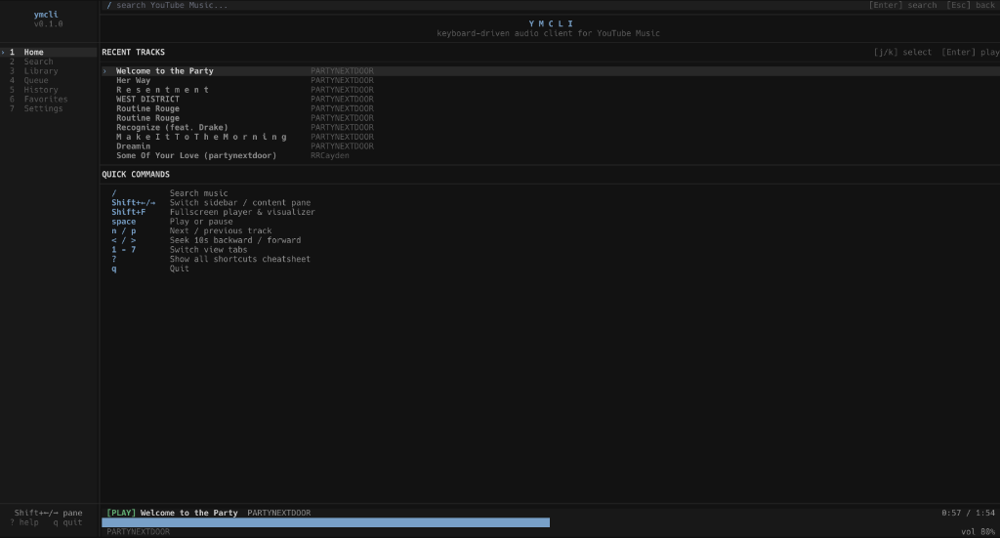

# ymcli

A keyboard-driven audio client for YouTube Music, built in C++20.

I built ymcli because I work in the terminal all day, and switching to a browser just to search for a track or pause a song felt clunky. Navigating and searching with vim keys is just faster. It streams audio directly through libmpv, talks to YouTube Music's InnerTube API, and renders a clean, quiet interface with FTXUI.



---

## Install

### Prerequisites

```
brew install mpv yt-dlp cmake openssl@3
```

### Build

```
git clone https://github.com/seirennn/ymcli.git
cd ymcli
mkdir build && cd build
cmake ..
make -j$(sysctl -n hw.ncpu)
sudo make install
```

### Run

```
ymcli
```

Flags:

```
ymcli --help
ymcli --version
```

---

## Authentication

ymcli works unauthenticated for public searches. Logging in loads your saved playlists, liked music, and history.

**Auto-detect (recommended)**
1. Open Settings (`7`)
2. Select Auto-Detect Browser — reads your local browser session (Arc, Chrome, Brave, Edge, Firefox) and signs in immediately.

**Manual cookies**
1. Open `music.youtube.com` in your browser.
2. DevTools (`F12`) → Network → copy `Cookie` from any `youtubei` request.
3. Paste in Settings → Authenticate.

Sessions are stored in `~/.config/ymcli/`.

---

## Controls

Press `?` inside ymcli anytime to open the full shortcuts cheatsheet.

### Playback

| Key | Action |
|---|---|
| `space` | Play / pause |
| `n` | Next track |
| `p` | Previous track (restarts if > 3s in) |
| `<` / `>` | Seek backward / forward 10s |
| `+` / `-` | Volume up / down |
| `m` | Mute toggle |
| `s` | Shuffle toggle |
| `r` | Cycle repeat mode |

### Navigation

| Key | Action |
|---|---|
| `/` | Focus search bar |
| `j` / `k` | Move down / up |
| `Enter` | Play track and queue upcoming |
| `Shift+←` / `Shift+→` | Switch pane (sidebar / content) |
| `Tab` | Toggle pane focus |
| `Shift+F` | Fullscreen player with visualizer |
| `1` – `7` | Switch tabs |
| `?` | Shortcuts cheatsheet |
| `Esc` | Unfocus / go back |
| `q` | Quit |

### Tabs

| Key | Tab |
|---|---|
| `1` | Home |
| `2` | Search |
| `3` | Library |
| `4` | Queue |
| `5` | History |
| `6` | Favorites |
| `7` | Settings |

### Track Actions

| Key | Action |
|---|---|
| `a` | Add track to queue |
| `l` | Add track to a playlist |
| `f` | Save / favorite track |
| `P` | Play all tracks in album or playlist |
| `A` | Add all tracks to queue |
| `d` | Delete track or local playlist |

---

## Library & Playlists

Tab `3` (Library) loads your YouTube Music playlists (Liked Music, custom playlists) and local playlists saved in ymcli.

- Press `n` in Library to create a new local playlist.
- Press `l` on any song anywhere to save it to a playlist.

---

## Stack

| | |
|---|---|
| Language | C++20 |
| Terminal UI | FTXUI |
| Audio | libmpv + yt-dlp |
| API | YouTube Music InnerTube (cpp-httplib + nlohmann/json) |
| Storage | SQLite3 |
